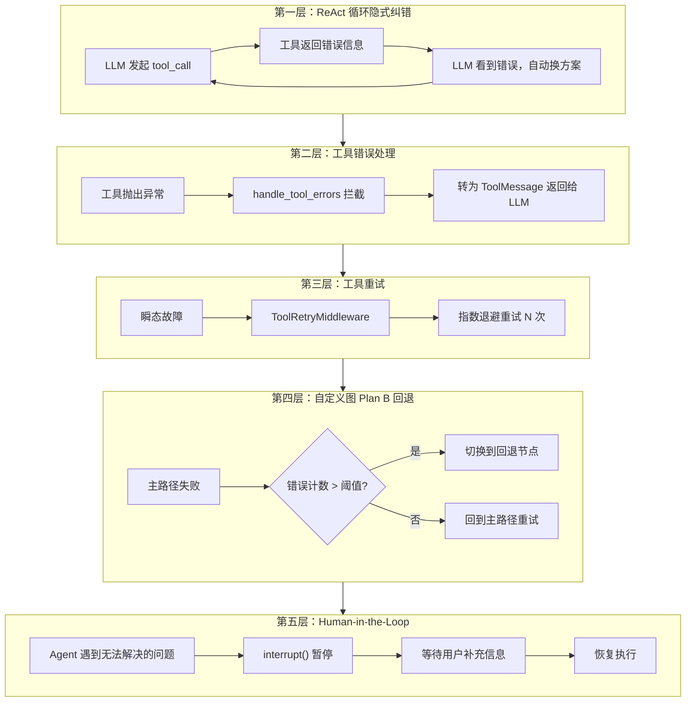
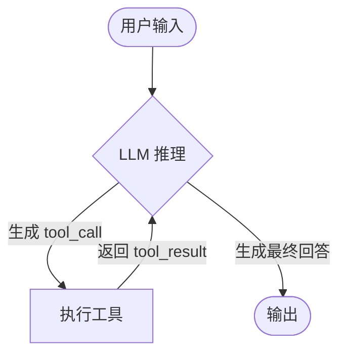
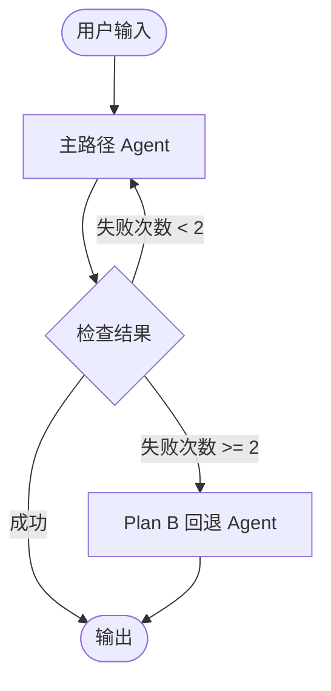

# Agent 自我纠错机制精讲

> 当用户输入一个 Agent 无法直接完成的请求时，Agent 如何自动寻找 Plan B？本文档系统讲解五层纠错机制，从最轻量的隐式纠错到最重量级的人机协作。

## 总览：五层纠错模型



| 层级 | 机制 | 谁来修复 | 适用场景 |
|------|------|----------|----------|
| 第一层 | ReAct 循环 | LLM 自主 | 参数错误、选错工具 |
| 第二层 | 工具错误处理 | LLM + 框架 | 工具运行时异常 |
| 第三层 | 工具重试 | 系统自动 | 网络超时、API 限流 |
| 第四层 | 自定义图回退 | 开发者预设 | 主方案彻底失败 |
| 第五层 | Human-in-the-Loop | 用户 | 信息不足、歧义请求 |

---

## 第一层：ReAct 循环的隐式纠错

### 原理

ReAct（Reasoning + Acting）是 Agent 最核心的设计模式。`create_react_agent` 构建的图结构如下：



关键在于：**工具的返回值（包括错误信息）会作为新的消息回传给 LLM**。LLM 能够"看到"失败，然后在下一轮推理中自动调整策略。

### 经典案例：SQL Agent 的自我修正

这是 LangChain 官方文档中最典型的自我纠错案例：

```python
system_prompt = """
You are an agent designed to interact with a SQL database.
Given an input question, create a syntactically correct {dialect} query to run,
then look at the results of the query and return the answer.

You MUST double check your query before executing it.
If you get an error while executing a query, rewrite the query and try again.
"""

agent = create_react_agent(model, sql_tools, system_prompt=system_prompt)
```

执行流程：

```
用户: "查找销量最高的产品"

[第1轮] LLM → tool_call: execute_sql("SELCT * FROM products ORDER BY sales")
        工具返回: "SQL error: near 'SELCT': syntax error"

[第2轮] LLM 看到错误 → tool_call: execute_sql("SELECT * FROM products ORDER BY sales DESC LIMIT 1")
        工具返回: {"name": "Widget A", "sales": 15000}

[第3轮] LLM → 最终回答: "销量最高的产品是 Widget A，销量 15000"
```

LLM 自动发现了拼写错误 `SELCT`，重写了正确的 SQL。**整个过程不需要任何额外的错误处理代码。**

### 在 Mini-OpenClaw 中的体现

当前 `agent.py` 使用 `create_react_agent`，天然具备这一能力：

```python
agent = create_react_agent(self.llm, self.tools)

for event in agent.stream({"messages": built_messages}, stream_mode="updates"):
    # 工具的错误信息会通过 ReAct 循环自动回传给 LLM
    ...
```

例如当 `read_file` 返回 `"read_file error: file not found."` 时，LLM 会在下一轮尝试其他路径或告知用户文件不存在。

---

## 第二层：工具错误处理（Tool Error Handling）

### 问题

第一层依赖工具自身返回友好的错误字符串。但如果工具直接 **抛出异常**（raise Exception），默认行为是让整个 Agent 崩溃，而不是把错误交给 LLM 处理。

### 方案 A：`create_react_agent` + `handle_tool_errors`

```python
from langgraph.prebuilt import create_react_agent, ToolNode


def handle_tool_error(error: Exception) -> str:
    """将异常转为 LLM 可读的错误信息"""
    return f"工具执行失败: {str(error)}。请检查参数后重试。"


agent = create_react_agent(
    model=llm,
    tools=ToolNode(
        [terminal, read_file, write_file],
        handle_tool_errors=handle_tool_error,  # 关键参数
    ),
)
```

效果：工具抛出的任何异常都会被拦截，转为 `ToolMessage` 返回给 LLM，LLM 可以据此修正。

### 方案 B：`create_agent` + `@wrap_tool_call` middleware

LangChain 1.x 的 `create_agent` 提供了更灵活的 middleware 机制：

```python
from langchain.agents import create_agent
from langchain.agents.middleware import wrap_tool_call
from langchain.messages import ToolMessage


@wrap_tool_call
def handle_tool_errors(request, handler):
    """拦截工具异常，转为 ToolMessage"""
    try:
        return handler(request)
    except Exception as e:
        return ToolMessage(
            content=f"工具错误: {str(e)}",
            tool_call_id=request.tool_call["id"],
        )


agent = create_agent(
    model="qwen3.5:9b",
    tools=[terminal, read_file, write_file],
    middleware=[handle_tool_errors],
)
```

### 在 Mini-OpenClaw 中的现状

当前的工具实现已经用 try/except 在工具内部捕获异常并返回错误字符串，这是第二层的简化形式：

```python
# read_file_tool.py 中
@tool
def read_file(path: str) -> str:
    target = (resolved_base / path).resolve()
    if not str(target).startswith(str(resolved_base)):
        return "read_file error: path traversal blocked."  # 不是 raise，而是返回错误字符串
    if not target.exists():
        return "read_file error: file not found."
    return target.read_text(encoding="utf-8")[:10000]
```

这种方式简单有效，但有局限：如果工具代码中有未预期的异常（如编码错误、权限问题），仍然会导致 Agent 崩溃。添加 `handle_tool_errors` 是更完善的兜底方案。

---

## 第三层：工具重试（Tool Retry）

### 问题

有些错误是瞬态的：网络超时、API 限流、服务暂时不可用。LLM 重试毫无意义（参数没变，结果一样），需要系统级的自动重试。

### ToolRetryMiddleware

```python
from langchain.agents import create_agent
from langchain.agents.middleware import ToolRetryMiddleware

agent = create_agent(
    model="qwen3.5:9b",
    tools=[fetch_url, search_knowledge_base],
    middleware=[
        ToolRetryMiddleware(
            max_retries=3,        # 最多重试 3 次
            backoff_factor=2.0,   # 指数退避倍数
            initial_delay=1.0,    # 初始延迟 1 秒
            retry_on=(TimeoutError, ConnectionError),  # 只重试这些异常
            on_failure="return_message",  # 重试耗尽后返回错误消息给 LLM
        ),
    ],
)
```

重试时序：

```
第 1 次: 立即执行 → 失败（TimeoutError）
第 2 次: 等待 1s → 重试 → 失败
第 3 次: 等待 2s → 重试 → 失败
第 4 次: 等待 4s → 重试 → 成功 ✓（或耗尽后返回错误给 LLM）
```

### `on_failure` 策略

| 值 | 行为 |
|---|---|
| `"return_message"` | 返回 ToolMessage 给 LLM，让 LLM 决定下一步（推荐） |
| `"raise"` | 抛出异常，终止 Agent |
| 自定义函数 | `lambda e: f"服务暂不可用: {e}"` |

---

## 第四层：LangGraph 自定义图 — Plan B 回退

### 问题

前三层处理的是"同一条路径上的重试"。但有时候需要的是**换一条完全不同的路径**——即 Plan B。例如：
- 主 API 不可用 → 切换到备用 API
- 精确搜索无结果 → 降级为模糊搜索
- 复杂推理失败 → 退化为简单模板回答

### 用 LangGraph 实现条件回退

```python
from langgraph.graph import StateGraph, START, END
from langgraph.types import Command
from typing import TypedDict, Literal


class AgentState(TypedDict):
    messages: list
    error_count: int
    strategy: str


def primary_agent(state: AgentState) -> Command[Literal["check_result"]]:
    """主路径：尝试用工具解决问题"""
    try:
        result = call_tools(state["messages"])
        return Command(
            update={"messages": state["messages"] + [result], "strategy": "primary"},
            goto="check_result",
        )
    except Exception as e:
        return Command(
            update={
                "messages": state["messages"] + [f"主路径失败: {e}"],
                "error_count": state["error_count"] + 1,
            },
            goto="check_result",
        )


def check_result(state: AgentState) -> Command[Literal["fallback_agent", "output"]]:
    """检查是否需要切换到 Plan B"""
    if state["error_count"] >= 2:
        return Command(goto="fallback_agent")
    if state["strategy"] == "primary":
        return Command(goto="output")
    return Command(goto="primary_agent")


def fallback_agent(state: AgentState) -> Command[Literal["output"]]:
    """Plan B：降级策略"""
    simple_response = generate_simple_response(state["messages"])
    return Command(
        update={"messages": state["messages"] + [simple_response]},
        goto="output",
    )


graph = StateGraph(AgentState)
graph.add_node("primary_agent", primary_agent)
graph.add_node("check_result", check_result)
graph.add_node("fallback_agent", fallback_agent)
graph.add_node("output", lambda s: s)

graph.add_edge(START, "primary_agent")
graph.add_edge("output", END)

app = graph.compile()
```

对应的图结构：



### 实际应用场景

| 场景 | 主路径 | Plan B |
|------|--------|--------|
| 知识检索 | RAG 向量搜索 | 关键词全文搜索 |
| 代码执行 | Python REPL | 返回代码让用户自行运行 |
| 文件操作 | write_file 写入 | 输出内容让用户手动保存 |
| 外部 API | 调用第三方服务 | 返回缓存结果或模板回答 |

---

## 第五层：Human-in-the-Loop

### 问题

有些情况下，Agent 确实无法自己解决——用户的请求有歧义、缺少关键信息、或者涉及需要人工确认的敏感操作。

### LangGraph 的 `interrupt()` 机制

```python
from langgraph.types import interrupt


def sensitive_operation(state: AgentState):
    """执行敏感操作前询问用户"""
    if state["action"] == "delete_file":
        user_confirmation = interrupt(
            "即将删除文件 {path}，是否确认？(yes/no)"
        )
        if user_confirmation != "yes":
            return {"messages": ["操作已取消"]}

    # 执行操作...
```

### 错误分类策略总表

这是 LangGraph 官方推荐的错误分类策略：

| 错误类型 | 修复者 | 策略 | 适用场景 |
|----------|--------|------|----------|
| 瞬态错误（网络、限流） | 系统自动 | Retry Policy | 临时故障，重试通常能解决 |
| LLM 可恢复错误（工具失败、解析错误） | LLM | 错误存入 state，回环重试 | LLM 看到错误后能调整方案 |
| 用户可修复错误（信息不足、指令模糊） | 人类 | `interrupt()` 暂停 | 需要用户补充信息 |
| 未知错误 | 开发者 | 直接上抛 | 未预期的 bug，需要调试 |

---

## 与 Mini-OpenClaw 的映射

### 当前已具备的能力

| 层级 | 状态 | 说明 |
|------|------|------|
| 第一层 | 已具备 | `create_react_agent` 的 ReAct 循环天然支持 |
| 第二层（简化版） | 已具备 | 工具内 try/except 返回错误字符串 |
| 第三层 | 未实现 | 无自动重试机制 |
| 第四层 | 未实现 | 无 Plan B 回退图 |
| 第五层 | 未实现 | 无 Human-in-the-Loop |

### 可增强方向

**短期（低成本）：** 为 `create_react_agent` 添加 `handle_tool_errors` 兜底：

```python
from langgraph.prebuilt import create_react_agent, ToolNode

agent = create_react_agent(
    self.llm,
    ToolNode(self.tools, handle_tool_errors=True),
)
```

**中期：** 将 `create_react_agent` 替换为自定义 LangGraph 图，加入错误计数和 Plan B 节点。

**长期：** 引入 `interrupt()` 实现 Human-in-the-Loop，前端配合展示确认对话框。

---

## 参考资料

- [LangGraph: Thinking in LangGraph — Handle errors appropriately](https://docs.langchain.com/oss/python/langgraph/thinking-in-langgraph)
- [LangChain: Agents — Tool error handling](https://docs.langchain.com/oss/python/langchain/agents)
- [LangChain: Built-in Middleware — Tool Retry](https://docs.langchain.com/oss/python/langchain/middleware/built-in)
- [LangChain: SQL Agent — Self-correction pattern](https://docs.langchain.com/oss/python/langchain/sql-agent)
- [LangGraph: Custom Workflow](https://docs.langchain.com/oss/python/langchain/multi-agent/custom-workflow)
