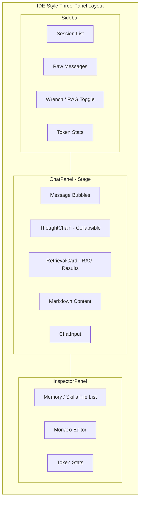
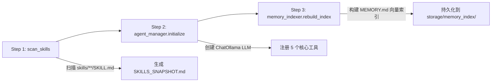
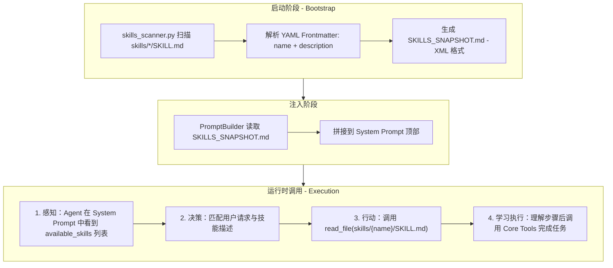
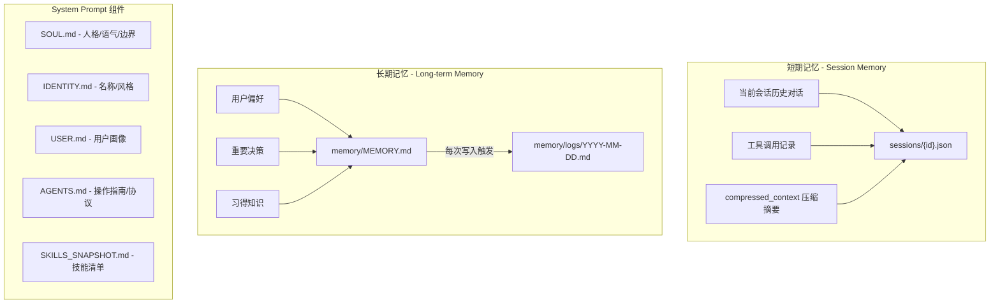
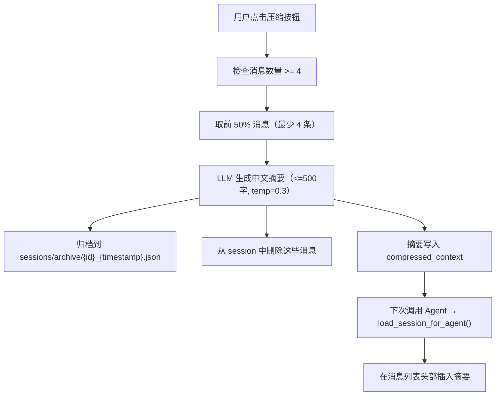
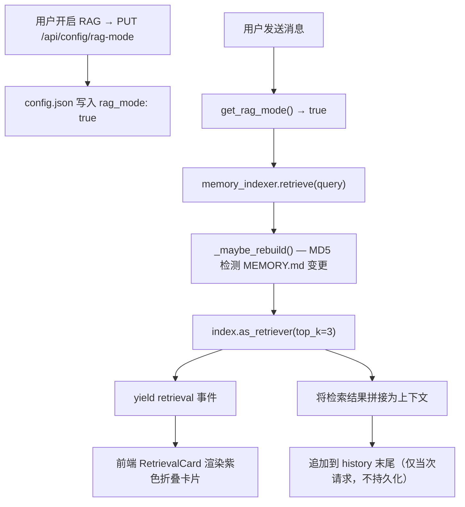
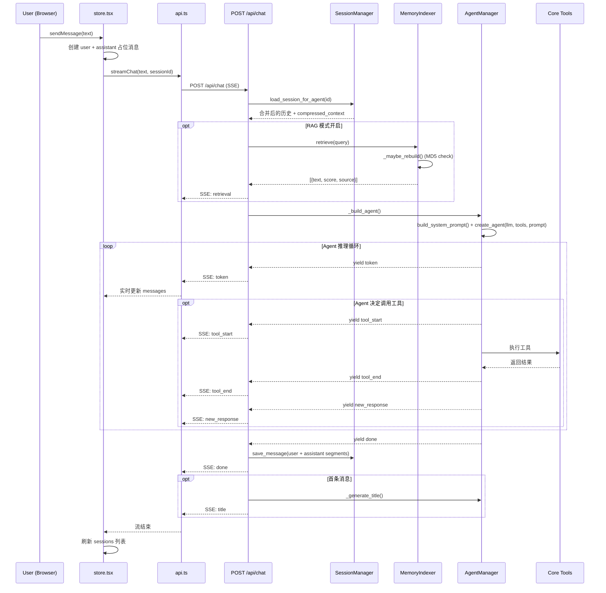

# Mini-OpenClaw 系统架构文档

---

## 1. 项目概述与设计哲学

### 1.1 项目定位

Mini-OpenClaw 是一个基于 Python 重构的、轻量级且高度透明的 AI Agent 系统，旨在复刻并优化 OpenClaw（原名 Moltbot/Clawdbot）的核心体验。项目不追求构建庞大的 SaaS 平台，而是致力于打造一个运行在本地的、拥有"真实记忆"的数字副手。

### 1.2 三大核心理念

| 理念 | 说明 |
|------|------|
| **文件即记忆 (File-first Memory)** | 摒弃不透明的向量数据库，回归 Markdown/JSON 文件系统。用户的每一次对话、Agent 的每一次反思，都以人类可读的文件形式存在。 |
| **技能即插件 (Skills as Plugins)** | 遵循 Anthropic 的 Agent Skills 范式，通过文件夹结构管理能力，实现"拖入即用"的技能扩展。 |
| **透明可控 (Transparent & Controllable)** | 所有的 System Prompt 拼接逻辑、工具调用过程、记忆读写操作对开发者完全透明，拒绝"黑盒"Agent。 |

### 1.3 与业界方案的差异化对比

| 维度 | OpenClaw | Mem0 (MaaS) | LangChain 原生 | **Mini-OpenClaw** |
|------|----------|-------------|----------------|-------------------|
| 存储方式 | Markdown + SQLite 向量库 | Vector DB + Graph DB + LLM | 内存 / VectorStore | **本地 JSON + Markdown** |
| 记忆透明度 | 高（本地文件可编辑） | 低（黑盒数据库） | 中 | **极高（所有状态可直接查看编辑）** |
| 部署复杂度 | 中 | 高（需 Qdrant/Neo4j/LLM） | 低 | **极低（无 MySQL/Redis）** |
| 技能扩展方式 | Markdown 指令 | N/A | Python 函数注册 | **Markdown 指令（Instruction-following）** |
| 自主进化能力 | 强 | 强 | 弱 | **中（通过 MEMORY.md 自主写入）** |

---

## 2. 技术选型

### 2.1 后端技术栈

| 层级 | 技术 | 说明 |
|------|------|------|
| Web 框架 | FastAPI + Uvicorn | 异步 HTTP + SSE 流式推送 |
| Agent 引擎 | LangGraph `create_react_agent` | 基于 LangGraph 运行时的 ReAct 循环；工具以 `@tool` 装饰器注册，支持多轮 tool_call 直到最终回答 |
| LLM | Ollama (`langchain-ollama`) | 通过 `ChatOllama` 接入远程 Ollama 服务（`http://122.224.127.38:11434`），默认模型 `qwen3.5:9b` |
| RAG 引擎 | LlamaIndex Core | 向量检索 + BM25 混合搜索 |
| Embedding | OpenAI `text-embedding-3-small` | 通过 `OPENAI_BASE_URL` 可切换代理 |
| Token 计数 | tiktoken `cl100k_base` | 精确 token 统计，与 GPT-4 系列编码器一致 |

### 2.2 前端技术栈

| 层级 | 技术 | 说明 |
|------|------|------|
| 框架 | Next.js 14 App Router | TypeScript + React 18 |
| UI | Tailwind CSS + Shadcn/UI | Apple 风格毛玻璃效果 |
| 代码编辑器 | Monaco Editor | 在线编辑 Memory/Skill 文件 |
| 状态管理 | React Context | 无 Redux，单一 `AppProvider` |

### 2.3 存储方案

| 类型 | 格式 | 路径 |
|------|------|------|
| 会话历史 | JSON | `sessions/{session_id}.json` |
| 长期记忆 | Markdown | `memory/MEMORY.md` |
| 记忆变更日志 | Markdown | `memory/logs/YYYY-MM-DD.md` |
| System Prompt 组件 | Markdown | `workspace/SOUL.md` 等 |
| 技能定义 | Markdown | `skills/{name}/SKILL.md` |
| 知识库 | PDF/MD/TXT | `knowledge/` |
| 向量索引 | LlamaIndex 持久化 | `storage/` |
| 全局配置 | JSON | `config.json` |

---

## 3. 系统架构总览

### 3.1 前后端分离架构

```mermaid
graph TB
    subgraph frontend [Frontend - Next.js 14 :3000]
        Browser[Browser Client]
        AppProvider[AppProvider Context]
        ChatPanel[ChatPanel]
        Inspector[InspectorPanel]
        Sidebar[Sidebar]
    end

    subgraph backend [Backend - FastAPI :8002]
        AppEntry[app.py Entry]

        subgraph apiLayer [API Layer]
            ChatAPI[chat.py - SSE Stream]
            SessionsAPI[sessions.py - CRUD]
            FilesAPI[files.py - Read/Write]
            TokensAPI[tokens.py - Count]
            CompressAPI[compress.py - Summarize]
            ConfigAPI[config_api.py - RAG Toggle]
            HeartbeatAPI[heartbeat_api.py - Heartbeat]
            CronAPI[cron_api.py - Cron Jobs]
            ChannelsAPI[channels_api.py - Channels]
            EvolutionAPI[evolution_api.py - Evolution]
        end

        subgraph graphEngine [Agent Engine - graph/]
            AgentMgr[AgentManager]
            SessionMgr[SessionManager]
            PromptBuilder[PromptBuilder]
            MemIndexer[MemoryIndexer]
        end

        subgraph tools [Core Tools - tools/]
            Terminal[terminal]
            PythonREPL[python_repl]
            FetchURL[fetch_url]
            ReadFile[read_file]
            SearchKB[search_knowledge_base]
            WriteFile[write_file]
            ListData[list_data_files]
            SetReminder[set_reminder]
        end

        subgraph services [Services]
            Heartbeat[heartbeat.py]
            CronScheduler[cron_scheduler.py]
            Evolution[evolution/]
            Channels[channels/]
        end
    end

    subgraph storage [Local File System]
        Sessions[(sessions/)]
        Memory[(memory/MEMORY.md)]
        Workspace[(workspace/)]
        Skills[(skills/)]
        Knowledge[(knowledge/)]
        StorageIdx[(storage/)]
    end

    Browser -->|SSE POST| ChatAPI
    Browser -->|REST| SessionsAPI
    Browser -->|REST| FilesAPI
    Browser -->|REST| TokensAPI
    Browser -->|REST| CompressAPI
    Browser -->|REST| ConfigAPI
    Browser -->|REST| HeartbeatAPI
    Browser -->|REST| CronAPI
    Browser -->|REST| ChannelsAPI
    Browser -->|REST| EvolutionAPI

    ChatAPI --> AgentMgr
    AgentMgr --> SessionMgr
    AgentMgr --> PromptBuilder
    AgentMgr --> MemIndexer
    AgentMgr --> tools

    HeartbeatAPI --> Heartbeat
    CronAPI --> CronScheduler
    ChannelsAPI --> Channels
    EvolutionAPI --> Evolution

    SessionMgr --> Sessions
    PromptBuilder --> Workspace
    PromptBuilder --> Memory
    PromptBuilder --> Skills
    MemIndexer --> StorageIdx
    SearchKB --> Knowledge
    ReadFile --> Skills
```



### 3.2 前端三栏布局



---

## 4. 后端架构详解

### 4.1 应用入口 `app.py`

通过 FastAPI 的 `lifespan` 机制执行三步启动初始化：



启动完成后注册 6 个 API 路由模块，所有路由挂载在 `/api` 前缀下。

### 4.2 Agent 引擎 `graph/`

#### 4.2.1 AgentManager (`agent.py`)

核心单例类，管理 Agent 生命周期。

| 方法 | 职责 |
|------|------|
| `initialize(base_dir, memory_indexer)` | 创建 `ChatOllama` LLM、以 `@tool` 格式加载工具列表（含 `write_file`）、初始化 `SessionManager` |
| `_build_messages()` | 将会话历史（dict 列表）转换为 LangChain 的 `HumanMessage` / `AIMessage` |
| `astream(message, history, session_id)` | 调用 `create_react_agent(llm, tools)` 并流式 yield SSE 事件 |

**`astream()` 流式事件序列：**

```
[普通模式] token... → tool_start → tool_end → token... → done
[RAG模式]  retrieval → token... → tool_start → tool_end → token... → done
```

#### 4.2.2 SessionManager (`session_manager.py`)

以 JSON 文件管理每个会话的完整历史。

| 方法 | 说明 |
|------|------|
| `load_session(id)` | 返回原始消息数组 |
| `load_session_for_agent(id)` | 为 LLM 优化：合并连续 assistant 消息、注入 `compressed_context` |
| `save_message(id, role, content, tool_calls)` | 追加消息到 JSON 文件 |
| `compress_history(id, summary, n)` | 归档前 N 条消息到 `sessions/archive/`，摘要写入 `compressed_context` |
| `get_compressed_context(id)` | 获取压缩摘要（多次压缩用 `---` 分隔） |

**关键机制 — `load_session_for_agent()` vs `load_session()`：**
LLM 要求严格的 user/assistant 交替，而实际存储中可能有连续多条 assistant 消息（工具调用产生的多段响应）。`load_session_for_agent()` 将它们合并为单条，并在存在 `compressed_context` 时于消息列表头部插入虚拟的 assistant 消息承载历史摘要。

#### 4.2.3 PromptBuilder (`prompt_builder.py`)

按固定顺序拼接 6 个 Markdown 文件为完整的 System Prompt：

| 顺序 | 组件 | 来源 |
|------|------|------|
| 1 | Skills 快照 | `SKILLS_SNAPSHOT.md` |
| 2 | 人格/语气/边界 | `workspace/SOUL.md` |
| 3 | 名称/风格 | `workspace/IDENTITY.md` |
| 4 | 用户画像 | `workspace/USER.md` |
| 5 | 操作指南/协议 | `workspace/AGENTS.md` |
| 6 | 长期记忆 | `memory/MEMORY.md`（RAG 模式下替换为引导语） |

每个文件内容上限 **20,000 字符**，超出则截断并标记 `...[truncated]`。各组件间以 `\n\n` 分隔，每个组件带 HTML 注释标签（如 `<!-- Soul -->`）便于调试定位。

#### 4.2.4 MemoryIndexer (`memory_indexer.py`)

专门为 `memory/MEMORY.md` 构建的 LlamaIndex 向量索引，独立于知识库索引。

| 方法 | 说明 |
|------|------|
| `rebuild_index()` | 读取 MEMORY.md → `SentenceSplitter(chunk_size=256, overlap=32)` 切片 → 构建 `VectorStoreIndex` → 持久化到 `storage/memory_index/` |
| `retrieve(query, top_k=3)` | 语义检索，返回 `[{text, score, source}]` |
| `_maybe_rebuild()` | 每次检索前通过 MD5 检查文件是否变更，变更则自动重建 |

当用户通过 Monaco 编辑器保存 MEMORY.md 时，`files.py` 的 `save_file` 端点也会主动触发 `rebuild_index()`。

### 4.3 七大核心工具 `tools/`

所有工具使用 LangChain `@tool` 装饰器定义，通过 `tools/__init__.py` 的 `get_all_tools(base_dir)` 统一注册，并传递给 `create_react_agent`。

| 工具 | 文件 | 功能 | 安全措施 |
|------|------|------|----------|
| `terminal` | `terminal_tool.py` | 执行 Shell 命令 | 黑名单（`rm -rf /`、`mkfs`、`shutdown` 等）；CWD 限制在项目根目录；30s 超时；输出截断 5000 字符 |
| `python_repl_ast` | `python_repl_tool.py` | 执行 Python 代码（AST 解析） | `PythonAstREPLTool`；自动捕获 stdout；自动去除 backtick；隔离命名空间 |
| `fetch_url` | `fetch_url_tool.py` | 抓取网页内容 | 自动识别 JSON/HTML；15s 超时；输出截断 5000 字符 |
| `read_file` | `read_file_tool.py` | 读取项目内文件 | 路径遍历检查（不可逃逸出 `root_dir`）；输出截断 10,000 字符 |
| `search_knowledge_base` | `search_knowledge_tool.py` | 搜索知识库 | 从 `knowledge/` 目录关键词检索；top-3 匹配 |
| `write_file` | `write_file_tool.py` | 写入项目内文件 | 路径白名单（`memory/`、`workspace/`、`skills/`、`knowledge/`）；路径遍历拦截；写入 `memory/MEMORY.md` 时自动记录 MD5 变更日志并触发索引重建 |
| `list_data_files` | `list_data_files_tool.py` | 列举 `data/` 目录下的数据文件结构 | 只读扫描；返回文件名、大小、Sheet 列表、列名、行数；供数据分析前探知数据结构 |
| `set_reminder` | `set_reminder_tool.py` | 设置定时提醒 | 路径白名单（memory/）；提醒写入 memory/logs/；触发 cron_scheduler 添加定时任务 |

**`skills_scanner.py`** 非工具，是启动时执行的扫描器：遍历 `skills/*/SKILL.md`，解析 YAML frontmatter（`name`、`description`），生成 XML 格式的 `SKILLS_SNAPSHOT.md`。

### 4.4 API 层 `api/`

#### 4.4.1 `chat.py` — 流式对话

`POST /api/chat` 是系统的核心端点。

**请求体：**
```json
{
  "message": "你好",
  "session_id": "abc123",
  "stream": true
}
```

**内部流程：**
1. 调用 `session_manager.load_session_for_agent()` 获取经过合并优化的历史
2. 判断是否为会话首条消息（用于后续自动生成标题）
3. 创建 `event_generator()`，内部调用 `agent_manager.astream()`
4. 按段（segment）追踪响应 —— 每次工具执行后 Agent 重新生成文本时开启新段
5. `done` 事件到达后：保存用户消息 + 每段助手消息到会话文件
6. 若为首条消息，额外调用 LLM 生成 ≤10 字的中文标题

**SSE 事件类型：**

| 事件 | 数据 | 触发时机 |
|------|------|----------|
| `thinking` | `{content}` | LLM 推理/思考过程（reasoning_content） |
| `retrieval` | `{query, results}` | RAG 模式检索完成后 |
| `token` | `{content}` | LLM 输出每个 token |
| `tool_start` | `{tool, args}` | Agent 决定调用工具时（工具执行前） |
| `tool_end` | `{tool, content}` | 工具执行完毕返回结果后 |
| `done` | `{content, session_id}` | 整轮响应结束，会话消息已写入磁盘 |
| `error` | `{error}` | 发生异常 |

#### 4.4.2 其他路由模块

**`sessions.py` — 会话管理**

| 端点 | 方法 | 说明 |
|------|------|------|
| `/api/sessions` | GET | 列出所有会话（按更新时间倒序） |
| `/api/sessions` | POST | 创建新会话（UUID 命名） |
| `/api/sessions/{id}` | PUT | 重命名会话 |
| `/api/sessions/{id}` | DELETE | 删除会话 |
| `/api/sessions/{id}/messages` | GET | 获取完整消息（含 System Prompt） |
| `/api/sessions/{id}/history` | GET | 获取对话历史（不含 System Prompt，含 tool_calls） |
| `/api/sessions/{id}/generate-title` | POST | AI 生成标题 |

**`files.py` — 文件操作**

路径白名单机制：允许的目录前缀为 `workspace/`、`memory/`、`skills/`、`knowledge/`，允许的根目录文件为 `SKILLS_SNAPSHOT.md`。包含路径遍历检测（`..` 攻击防护）。保存 `memory/MEMORY.md` 时自动触发 `memory_indexer.rebuild_index()`。

| 端点 | 方法 | 说明 |
|------|------|------|
| `/api/files?path=...` | GET | 读取文件内容 |
| `/api/files` | POST | 保存文件（编辑器用） |
| `/api/skills` | GET | 列出可用技能 |

**`tokens.py` — Token 统计**

| 端点 | 方法 | 说明 |
|------|------|------|
| `/api/tokens/session/{id}` | GET | 返回 `{system_tokens, message_tokens, total_tokens}` |
| `/api/tokens/files` | POST | 批量统计文件 token 数，body: `{paths: [...]}` |

**`compress.py` — 对话压缩**

| 端点 | 方法 | 说明 |
|------|------|------|
| `/api/sessions/{id}/compress` | POST | 压缩前 50% 历史消息 |

压缩流程：检查消息数量 ≥ 4 → 取前 50% 消息（最少 4 条） → 调用 LLM（temperature=0.3）生成中文摘要（≤500 字） → 归档 + 写入摘要 → 返回 `{archived_count, remaining_count}`。归档文件存储在 `sessions/archive/{session_id}_{timestamp}.json`。

**`config_api.py` — 配置管理**

| 端点 | 方法 | 说明 |
|------|------|------|
| `/api/config/rag-mode` | GET | 获取 RAG 模式状态 |
| `/api/config/rag-mode` | PUT | 切换 RAG 模式，body: `{enabled: bool}` |

配置持久化到 `backend/config.json`。

**`heartbeat_api.py` — 心跳监控**

| 端点 | 方法 | 说明 |
|------|------|------|
| `/api/heartbeat/status` | GET | 获取心跳状态 |
| `/api/heartbeat/trigger` | POST | 手动触发心跳 |
| `/api/heartbeat/config` | POST | 配置心跳参数 |
| `/api/heartbeat/metrics` | GET | 获取心跳指标 |

**`cron_api.py` — 定时任务管理**

| 端点 | 方法 | 说明 |
|------|------|------|
| `/api/cron/jobs` | GET | 列出所有定时任务 |
| `/api/cron/jobs` | POST | 创建新定时任务 |
| `/api/cron/jobs/{job_id}` | GET | 获取任务详情 |
| `/api/cron/jobs/{job_id}` | PUT | 更新任务 |
| `/api/cron/jobs/{job_id}` | DELETE | 删除任务 |
| `/api/cron/jobs/{job_id}/trigger` | POST | 手动触发任务 |
| `/api/cron/jobs/{job_id}/history` | GET | 获取任务执行历史 |
| `/api/cron/templates` | GET | 获取任务模板列表 |
| `/api/cron/templates/{template_id}` | GET | 获取模板详情 |
| `/api/cron/jobs/from-template` | POST | 从模板创建任务 |
| `/api/cron/status` | GET | 获取调度器状态 |
| `/api/cron/export` | GET | 导出任务配置 |
| `/api/cron/import` | POST | 导入任务配置 |
| `/api/cron/metrics` | GET | 获取任务指标 |

**`channels_api.py` — 多渠道通知**

| 端点 | 方法 | 说明 |
|------|------|------|
| `/api/channels/status` | GET | 获取所有渠道状态 |
| `/api/channels/test` | POST | 测试渠道连接 |
| `/api/channels/send` | POST | 发送消息到渠道 |
| `/api/channels/list` | GET | 列出可用渠道 |
| `/api/channels/config/telegram` | POST | 配置 Telegram 渠道 |
| `/api/channels/config/feishu` | POST | 配置飞书渠道 |

**`evolution_api.py` — Agent 进化系统**

| 端点 | 方法 | 说明 |
|------|------|------|
| `/api/evolution/skills/discover` | POST | 发现新技能 |
| `/api/evolution/skills/summary` | GET | 获取技能摘要 |
| `/api/evolution/prompt/analyze` | POST | 分析提示词 |
| `/api/evolution/prompt/summary` | GET | 获取提示词摘要 |
| `/api/evolution/workflow/analyze` | POST | 分析工作流 |
| `/api/evolution/workflow/summary` | GET | 获取工作流摘要 |
| `/api/evolution/workflow/executions` | GET | 获取工作流执行记录 |
| `/api/evolution/auto` | POST | 触发自动进化 |
| `/api/evolution/status` | GET | 获取进化系统状态 |
| `/api/evolution/scheduler/start` | POST | 启动进化调度器 |
| `/api/evolution/scheduler/stop` | POST | 停止进化调度器 |
| `/api/evolution/scheduler/config` | GET | 获取调度器配置 |
| `/api/evolution/scheduler/config` | POST | 配置调度器 |

---

## 5. Agent Skills 系统

### 5.1 设计范式

Mini-OpenClaw 的 Skills 遵循 **Instruction-following（指令遵循）** 范式，而非传统的 **Function-calling（函数调用）** 范式。Skills 本质上是教会 Agent 如何使用基础工具（Terminal/Python/Fetch）去完成任务的说明书，而不是预先写好的 Python 函数。

### 5.2 目录结构

```
skills/
└── get_weather/
    └── SKILL.md
```

**SKILL.md 格式示例：**

```yaml
---
name: get_weather
description: 获取指定城市的实时天气信息
---
# 获取天气

## 功能
查询指定城市的当前天气状况，包括温度、湿度和天气描述。

## 使用方式
提供城市名称，返回该城市的实时天气数据。

## 示例
- 输入：北京
- 输出：北京当前天气为晴，温度 25°C，湿度 60%
```

### 5.3 Skills 生命周期



### 5.4 SKILLS_SNAPSHOT.md 格式

```xml
<available_skills>
  <skill>
    <name>get_weather</name>
    <description>获取指定城市的实时天气信息</description>
    <location>./skills/get_weather/SKILL.md</location>
  </skill>
</available_skills>
```

---

## 6. 记忆管理系统

### 6.1 双层记忆模型



### 6.2 System Prompt 六组件动态拼接

Agent 每次被调用时都会重新读取所有 Markdown 文件并组装 System Prompt，确保 workspace 文件的实时编辑能立即生效。

```
┌───────────────────────────────────────┐
│ <!-- Skills Snapshot -->              │ ← SKILLS_SNAPSHOT.md
│ <!-- Soul -->                         │ ← workspace/SOUL.md
│ <!-- Identity -->                     │ ← workspace/IDENTITY.md
│ <!-- User Profile -->                 │ ← workspace/USER.md
│ <!-- Agents Guide -->                 │ ← workspace/AGENTS.md
│ <!-- Long-term Memory -->             │ ← memory/MEMORY.md（RAG 模式下替换为引导语）
└───────────────────────────────────────┘
```

**RAG 模式下的变化：** 跳过 MEMORY.md 全文注入，改为追加一段 RAG 引导语，告知 Agent 记忆将通过检索动态注入到每次请求的上下文中。

### 6.3 会话存储格式

文件路径：`sessions/{session_id}.json`

```json
{
  "title": "讨论天气查询",
  "created_at": 1706000000.0,
  "updated_at": 1706000100.0,
  "compressed_context": "用户之前询问了北京天气...",
  "messages": [
    { "role": "user", "content": "北京天气怎么样？" },
    {
      "role": "assistant",
      "content": "让我查一下...",
      "tool_calls": [
        { "tool": "terminal", "input": "curl wttr.in/Beijing", "output": "..." }
      ]
    },
    { "role": "assistant", "content": "北京今天晴，气温 25°C。" }
  ]
}
```

**格式说明：**
- v1 兼容：如果文件内容是纯数组 `[...]`，`_read_file()` 会自动迁移为 v2 格式
- 多段 assistant：一次工具调用后会产生多条连续的 assistant 消息
- `compressed_context`：可选字段，多次压缩用 `---` 分隔

### 6.4 对话压缩机制



### 6.5 RAG 检索机制



---

## 7. 核心数据流

### 7.1 用户发送消息 — 完整序列



---

## 8. 前端架构

### 8.1 三栏 IDE 风格布局

```
┌──────────────────────────────────────────────────────────┐
│ Navbar（mini OpenClaw / 赋范空间）                          │
├──────────┬──────────────────────────┬────────────────────┤
│ Sidebar  │       ChatPanel          │  InspectorPanel    │
│          │                          │                    │
│ 会话列表  │  消息气泡                 │  Memory / Skills   │
│          │  ├─ ThoughtChain         │  文件列表           │
│ Raw Msgs │  ├─ RetrievalCard        │  Monaco 编辑器      │
│ 扳手/RAG │  └─ Markdown 内容         │  Token 统计        │
│ Token统计│                          │                    │
│          │  ChatInput               │                    │
├──────────┴──────────────────────────┴────────────────────┤
│                   ResizeHandle (可拖拽)                    │
└──────────────────────────────────────────────────────────┘
```

### 8.2 状态管理

全部通过 `store.tsx` 的 React Context 管理，包括：
- 消息列表（messages）
- 会话切换（current session）
- 面板宽度（panel widths）
- 流式状态（streaming state）
- 压缩状态（compression state）
- RAG 模式开关

### 8.3 SSE 流式通信

`api.ts` 中的 `streamChat()` 实现了自定义的 SSE 解析器，因为浏览器原生 `EventSource` 只支持 GET 请求，而聊天接口是 POST。

`API_BASE` 动态取 `window.location.hostname`，自动适配本机（localhost）和局域网访问。

### 8.4 核心组件

| 组件 | 路径 | 功能 |
|------|------|------|
| `ChatPanel` | `components/chat/ChatPanel.tsx` | 聊天面板（消息列表 + 输入框） |
| `ChatMessage` | `components/chat/ChatMessage.tsx` | 消息气泡（Markdown 渲染） |
| `ChatInput` | `components/chat/ChatInput.tsx` | 输入框 |
| `ThoughtChain` | `components/chat/ThoughtChain.tsx` | LLM 思维链展示（可折叠） |
| `RetrievalCard` | `components/chat/RetrievalCard.tsx` | RAG 检索结果卡片 |
| `SettingsModal` | `components/SettingsModal.tsx` | 设置弹窗 |
| `RagToggle` | `components/RagToggle.tsx` | RAG 模式开关 |
| `Navbar` | `components/layout/Navbar.tsx` | 顶部导航栏 |
| `Sidebar` | `components/layout/Sidebar.tsx` | 左侧边栏（会话列表 + Raw Messages） |
| `ResizeHandle` | `components/layout/ResizeHandle.tsx` | 面板拖拽分隔条 |
| `InspectorPanel` | `components/editor/InspectorPanel.tsx` | 右侧检查器（Monaco 编辑器） |

---

## 9. API 接口速查表

| 路径 | 方法 | 说明 |
|------|------|------|
| `/api/chat` | POST | SSE 流式对话 |
| `/api/sessions` | GET | 列出所有会话 |
| `/api/sessions` | POST | 创建新会话 |
| `/api/sessions/{id}` | PUT | 重命名会话 |
| `/api/sessions/{id}` | DELETE | 删除会话 |
| `/api/sessions/{id}/messages` | GET | 获取完整消息（含 System Prompt） |
| `/api/sessions/{id}/history` | GET | 获取对话历史 |
| `/api/sessions/{id}/generate-title` | POST | AI 生成标题 |
| `/api/sessions/{id}/compress` | POST | 压缩对话历史 |
| `/api/files?path=...` | GET | 读取文件 |
| `/api/files` | POST | 保存文件 |
| `/api/skills` | GET | 列出技能 |
| `/api/tokens/session/{id}` | GET | 会话 Token 统计 |
| `/api/tokens/files` | POST | 文件 Token 统计 |
| `/api/config/rag-mode` | GET | 获取 RAG 模式状态 |
| `/api/config/rag-mode` | PUT | 切换 RAG 模式 |

---

## 10. 关键设计决策

| 决策 | 理由 |
|------|------|
| 使用 `create_agent()` 而非 `AgentExecutor` | LangChain 1.x 推荐的现代 API，支持原生流式 |
| 每次请求重建 Agent | 确保 System Prompt 反映 workspace 文件的实时编辑 |
| 文件驱动而非数据库 | 降低部署门槛，所有状态对开发者透明可查 |
| 技能 = Markdown 指令 | Agent 自主阅读并执行，不需要注册新的 Python 函数 |
| 多段响应分别存储 | 忠实保留工具调用前后的文本段，Raw Messages 可完整审查 |
| System Prompt 组件截断 20K | 防止 MEMORY.md 膨胀导致上下文溢出 |
| RAG 检索结果不持久化 | 避免会话文件膨胀，检索上下文仅用于当次请求 |
| 路径白名单 + 遍历检测 | 双重防护，终端和文件读取工具均受沙箱约束 |
| `window.location.hostname` 动态 API 地址 | 一份代码同时支持本机和局域网访问 |

---

## 11. 项目目录结构

```
mini-OpenClaw/
├── backend/
│   ├── app.py                        # FastAPI 入口，路由注册，启动初始化
│   ├── config.py                     # 全局配置管理（config.json 持久化）
│   ├── requirements.txt              # Python 依赖
│   ├── .env.example                  # 环境变量模板
│   │
│   ├── api/                          # API 路由层
│   │   ├── chat.py                   # POST /api/chat — SSE 流式对话
│   │   ├── sessions.py               # 会话 CRUD + 标题生成
│   │   ├── files.py                  # 文件读写 + 技能列表
│   │   ├── tokens.py                 # Token 统计
│   │   ├── compress.py               # 对话压缩
│   │   ├── config_api.py             # RAG 模式开关
│   │   ├── heartbeat_api.py          # 心跳监控
│   │   ├── cron_api.py               # 定时任务管理
│   │   ├── channels_api.py           # 多渠道通知
│   │   └── evolution_api.py          # Agent 进化系统
│   │
│   ├── graph/                        # Agent 核心逻辑
│   │   ├── agent.py                  # AgentManager — 构建 & 流式调用
│   │   ├── session_manager.py        # 会话持久化（JSON 文件）
│   │   ├── prompt_builder.py         # System Prompt 组装器
│   │   └── memory_indexer.py         # MEMORY.md 向量索引（RAG）
│   │
│   ├── tools/                        # 8 个核心工具（@tool 装饰器格式）
│   │   ├── __init__.py               # 工具注册工厂 get_all_tools()
│   │   ├── terminal_tool.py          # 沙箱终端
│   │   ├── python_repl_tool.py       # Python 解释器（PythonAstREPLTool）
│   │   ├── fetch_url_tool.py         # 网页抓取
│   │   ├── read_file_tool.py         # 沙箱文件读取
│   │   ├── search_knowledge_tool.py  # 知识库搜索
│   │   ├── write_file_tool.py        # 白名单文件写入 + MEMORY.md 变更日志
│   │   ├── list_data_files_tool.py   # 数据文件结构探查（Sheet / 列名 / 行数）
│   │   ├── set_reminder_tool.py      # 定时提醒设置
│   │   └── skills_scanner.py        # 技能目录扫描器
│   │
│   ├── heartbeat.py                  # Agent 心跳和诊断机制
│   ├── cron_scheduler.py             # 定时任务调度器
│   │
│   ├── evolution/                    # Agent 自动进化引擎
│   │   ├── evolution_engine.py
│   │   ├── skill_discovery.py
│   │   ├── prompt_evolution.py
│   │   └── workflow_evolution.py
│   │
│   ├── evolution_data/               # 进化数据存储
│   │   ├── known_skills.json
│   │   ├── last_skill.json
│   │   ├── last_prompt.json
│   │   └── last_workflow.json
│   │
│   ├── channels/                     # 多渠道消息发送
│   │   ├── telegram_handler.py
│   │   └── feishu_handler.py
│   │
│   ├── workspace/                    # System Prompt 组件
│   │   ├── SOUL.md                   # 人格、语气、边界
│   │   ├── IDENTITY.md               # 名称、风格、Emoji
│   │   ├── USER.md                   # 用户画像
│   │   └── AGENTS.md                 # 操作指南 & 记忆/技能协议
│   │
│   ├── skills/                       # 技能目录（每个技能一个子目录）
│   │   ├── get_weather/SKILL.md      # 天气查询技能
│   │   ├── data_analysis/SKILL.md    # 数据分析技能（pandas + Excel/CSV）
│   │   └── reminder/SKILL.md         # 提醒设置技能
│   │
│   ├── data/                         # 数据文件目录（Excel / CSV，不提交 Git）
│   │   └── .gitkeep                  # 占位文件，保证目录被 Git 追踪
│   │
│   ├── memory/                       # 长期记忆
│   │   ├── MEMORY.md                 # 跨会话长期记忆
│   │   └── logs/                     # 每次修改 MEMORY.md 的变更日志（按日期）
│   ├── knowledge/                    # 知识库文档（供 RAG 检索）
│   ├── sessions/                     # 会话 JSON 文件
│   │   └── archive/                  # 压缩归档
│   ├── storage/                      # LlamaIndex 持久化索引
│   │   └── memory_index/             # MEMORY.md 专用索引
│   └── SKILLS_SNAPSHOT.md            # 技能快照（启动时自动生成）
│
└── frontend/
    └── src/
        ├── app/
        │   ├── layout.tsx            # Next.js 根布局
        │   ├── page.tsx              # 主页面（三栏布局）
        │   └── globals.css           # 全局样式
        ├── lib/
        │   ├── store.tsx             # React Context 状态管理
        │   └── api.ts                # 后端 API 客户端
        └── components/
            ├── chat/
            │   ├── ChatPanel.tsx      # 聊天面板（消息列表 + 输入框）
            │   ├── ChatMessage.tsx    # 消息气泡（Markdown 渲染）
            │   ├── ChatInput.tsx      # 输入框
            │   ├── ThoughtChain.tsx   # 工具调用思维链（可折叠）
            │   └── RetrievalCard.tsx  # RAG 检索结果卡片
            ├── layout/
            │   ├── Navbar.tsx         # 顶部导航栏
            │   ├── Sidebar.tsx        # 左侧边栏（会话列表 + Raw Messages）
            │   └── ResizeHandle.tsx   # 面板拖拽分隔条
            └── editor/
                └── InspectorPanel.tsx # 右侧检查器（Monaco 编辑器）
```

---

## 12. 环境配置与启动

### 12.1 环境变量

复制 `.env.example` 为 `.env` 并填入：

```env
# Ollama（Agent 主模型）
OLLAMA_BASE_URL=http://122.224.127.38:11434
OLLAMA_MODEL=qwen3.5:9b

# OpenAI（Embedding 模型，用于知识库 & RAG 检索）
OPENAI_API_KEY=sk-xxx
OPENAI_BASE_URL=https://api.openai.com/v1
EMBEDDING_MODEL=text-embedding-3-small
```

`OPENAI_BASE_URL` 支持换成任意兼容 OpenAI Embedding 接口的代理地址。

### 12.2 启动方式

```bash
# 后端（端口 8002）
cd backend
pip install -r requirements.txt
uvicorn app:app --port 8002 --host 0.0.0.0 --reload

# 前端（端口 3000）
cd frontend
npm install
npm run dev
```

本机访问 `http://localhost:3000`，局域网内其他设备访问 `http://<本机IP>:3000`。
