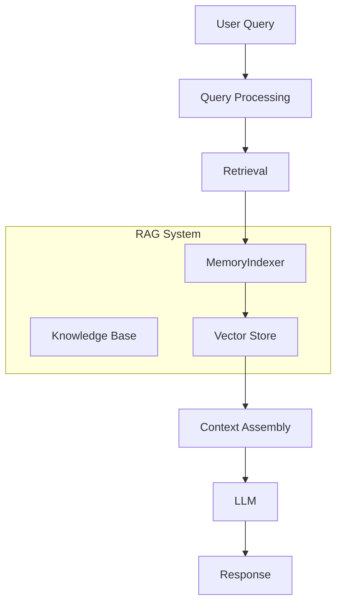
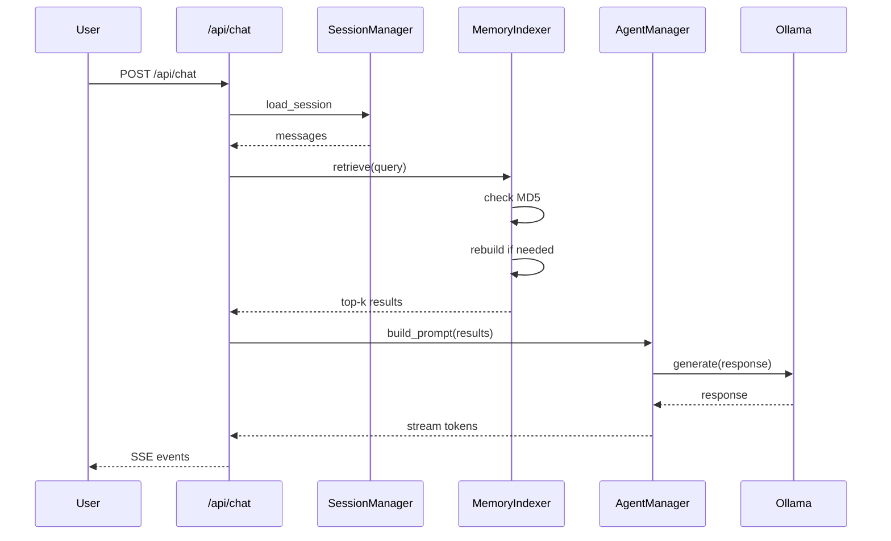

# RAG System Design | RAG 系统设计

---

## 1. Overview | 概述

This document describes the Retrieval-Augmented Generation (RAG) system in Mini-OpenClaw, including architecture, implementation, and configuration.

本文档描述 Mini-OpenClaw 中的检索增强生成（RAG）系统，包括架构、实现和配置。

---

## 2. Architecture | 架构

### 2.1 RAG Components | RAG 组件



### 2.2 RAG Modes | RAG 模式

| Mode | Description | Use Case |
|------|-------------|-----------|
| Full Memory | Inject full MEMORY.md to prompt | Small memory, high relevance |
| RAG Retrieval | Semantic search + top-k injection | Large memory, selective retrieval |
| Hybrid | Combine both modes | Balanced approach |

---

## 3. Memory Indexer | 记忆索引器

### 3.1 Overview | 概述

The MemoryIndexer is responsible for building and maintaining a vector index of MEMORY.md, enabling semantic search for relevant context.

MemoryIndexer 负责构建和维护 MEMORY.md 的向量索引，支持语义搜索以获取相关上下文。

### 3.2 Implementation | 实现

```python
# graph/memory_indexer.py
import hashlib
import os
from llama_index import VectorStoreIndex, SentenceSplitter
from llama_index.storage import StorageContext
from llama_index.vector_stores import SimpleVectorStore


class MemoryIndexer:
    def __init__(self, memory_path: str, storage_path: str):
        self.memory_path = memory_path
        self.storage_path = storage_path
        self.index = None
        self._current_md5 = None

    def rebuild_index(self):
        """Rebuild the vector index from MEMORY.md."""
        # Read MEMORY.md | 读取 MEMORY.md
        with open(self.memory_path, 'r') as f:
            memory_content = f.read()

        # Calculate MD5 | 计算 MD5
        self._current_md5 = hashlib.md5(memory_content.encode()).hexdigest()

        # Split into chunks | 分块
        splitter = SentenceSplitter(
            chunk_size=256,
            chunk_overlap=32
        )
        nodes = splitter.get_nodes_from_documents([memory_content])

        # Build index | 构建索引
        self.index = VectorStoreIndex(nodes)

        # Persist | 持久化
        self.index.set_index_id("memory_index")
        self.index.storage_context.persist(self.storage_path)

    def retrieve(self, query: str, top_k: int = 3) -> List[dict]:
        """Retrieve relevant context for a query."""
        # Check if rebuild needed | 检查是否需要重建
        self._maybe_rebuild()

        # Retrieve | 检索
        retriever = self.index.as_retriever(top_k=top_k)
        results = retriever.retrieve(query)

        return [
            {
                "text": node.text,
                "score": node.score,
                "source": "memory/MEMORY.md"
            }
            for node in results
        ]

    def _maybe_rebuild(self):
        """Rebuild index if MEMORY.md has changed."""
        with open(self.memory_path, 'r') as f:
            current_md5 = hashlib.md5(f.read().encode()).hexdigest()

        if current_md5 != self._current_md5:
            self.rebuild_index()
```

### 3.3 Configuration | 配置

| Parameter | Default | Description |
|-----------|---------|-------------|
| `chunk_size` | 256 | Number of tokens per chunk |
| `chunk_overlap` | 32 | Overlap between chunks |
| `top_k` | 3 | Number of results to retrieve |
| `similarity_threshold` | 0.7 | Minimum similarity score |

---

## 4. Knowledge Base | 知识库

### 4.1 Knowledge Base Structure | 知识库结构

```
knowledge/
├── docs/
│   ├── policies.md
│   └── faq.md
├── pdfs/
│   ├── manual.pdf
│   └── guide.pdf
└── txt/
    └── notes.txt
```

### 4.2 Knowledge Search | 知识搜索

```python
# tools/search_knowledge_tool.py
from llama_index import VectorStoreIndex, SimpleDirectoryReader


class KnowledgeSearchTool:
    def __init__(self, knowledge_dir: str):
        self.knowledge_dir = knowledge_dir
        self.index = None

    def build_index(self):
        """Build index from knowledge directory."""
        documents = SimpleDirectoryReader(self.knowledge_dir).load_data()
        self.index = VectorStoreIndex.from_documents(documents)

    def search(self, query: str, top_k: int = 3) -> List[dict]:
        """Search knowledge base."""
        if not self.index:
            self.build_index()

        retriever = self.index.as_retriever(top_k=top_k)
        results = retriever.retrieve(query)

        return [
            {
                "text": node.text,
                "source": node.node.extra_info.get("file_name"),
                "score": node.score
            }
            for node in results
        ]
```

### 4.3 Supported Formats | 支持的格式

| Format | Extension | Notes |
|--------|-----------|-------|
| Markdown | .md | Best support |
| PDF | .pdf | Requires PyPDF2 |
| Text | .txt | Plain text |
| CSV | .csv | Tabular data |

---

## 5. Hybrid Search | 混合搜索

### 5.1 Why Hybrid Search | 为什么使用混合搜索

- Vector search captures semantic similarity
- Keyword search handles specific terms
- Combined approach provides better results

### 5.2 Implementation | 实现

```python
# hybrid_search.py
from llama_index import VectorStoreIndex
from llama_index.retrievers import BM25Retriever


class HybridSearch:
    def __init__(self, vector_index, documents):
        self.vector_index = vector_index
        self.bm25_retriever = BM25Retriever.from_documents(documents)

    def search(self, query: str, alpha: float = 0.5) -> List[dict]:
        """Combined vector and keyword search."""
        # Vector search | 向量搜索
        vector_results = self.vector_index.as_retriever().retrieve(query)

        # Keyword search | 关键词搜索
        keyword_results = self.bm25_retriever.retrieve(query)

        # Merge and rerank | 合并和重排
        combined = self._merge_results(
            vector_results,
            keyword_results,
            alpha=alpha
        )

        return combined

    def _merge_results(self, vector_results, keyword_results, alpha):
        """Merge results with weighted scoring."""
        # Implementation details
        pass
```

---

## 6. RAG in Agent Flow | Agent 流程中的 RAG

### 6.1 Flow Diagram | 流程图



### 6.2 RAG Mode Toggle | RAG 模式开关

```python
# api/config_api.py
from fastapi import APIRouter

router = APIRouter()


@router.get("/config/rag-mode")
async def get_rag_mode():
    return {"enabled": config.get("rag_mode", False)}


@router.put("/config/rag-mode")
async def set_rag_mode(request: dict):
    enabled = request.get("enabled", False)
    config.set("rag_mode", enabled)
    return {"enabled": enabled}
```

---

## 7. Performance Optimization | 性能优化

### 7.1 Caching | 缓存

- Cache index in memory for fast access
- Persist to disk for quick rebuild
- Invalidate on MEMORY.md changes

### 7.2 Async Operations | 异步操作

- Build index asynchronously at startup
- Retrieve in parallel with prompt building
- Use async/await for I/O operations

### 7.3 Index Optimization | 索引优化

- Use appropriate chunk size
- Filter low-similarity results
- Limit context length to prevent overflow

---

## 8. Monitoring | 监控

### 8.1 Metrics | 指标

| Metric | Description |
|--------|-------------|
| `rag_retrieval_count` | Number of retrievals |
| `rag_retrieval_time` | Time taken for retrieval |
| `rag_retrieval_results` | Number of results per query |
| `rag_cache_hit_rate` | Cache hit rate |

### 8.2 Logs | 日志

```python
logger.info(f"RAG retrieval: query='{query}', results={len(results)}, time={elapsed}s")
```

---

## 9. Troubleshooting | 故障排除

### 9.1 Common Issues | 常见问题

| Issue | Cause | Solution |
|-------|-------|----------|
| No results | Empty MEMORY.md | Add content to MEMORY.md |
| Irrelevant results | Wrong chunk size | Adjust chunk_size |
| Slow retrieval | Large index | Optimize chunking or use caching |
| Index not building | File format error | Check file permissions |

### 9.2 Debugging | 调试

```python
# Enable verbose logging | 启用详细日志
import logging
logging.basicConfig(level=logging.DEBUG)
```

---

## 10. Related Documents | 相关文档

- [ARCHITECTURE.md](ARCHITECTURE.md) - System Architecture
- [DATABASE.md](DATABASE.md) - Data Model
- [API.md](API.md) - API Documentation
