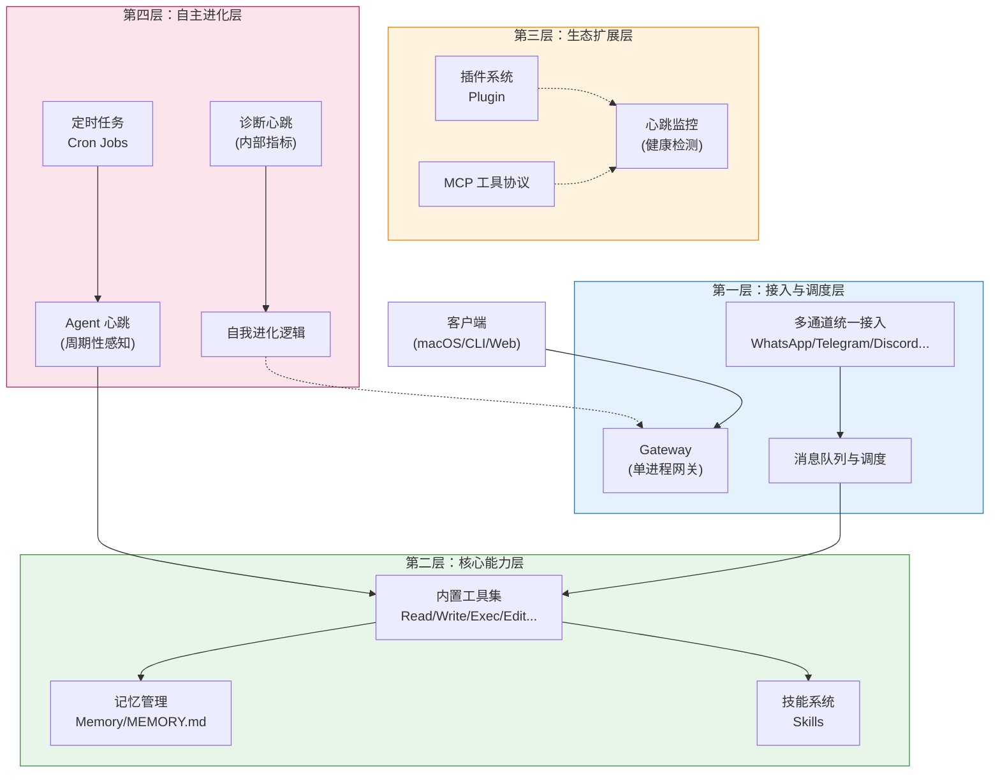
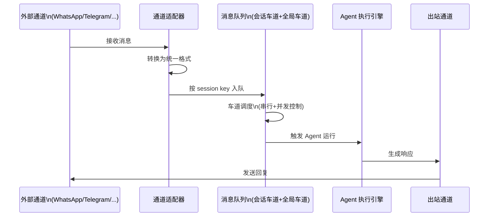
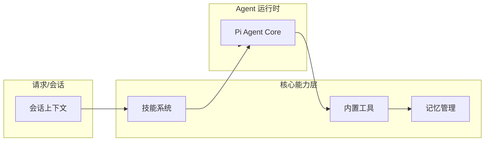
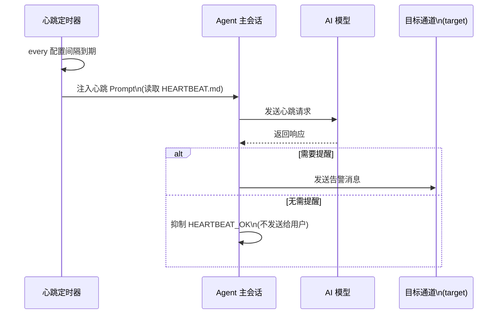
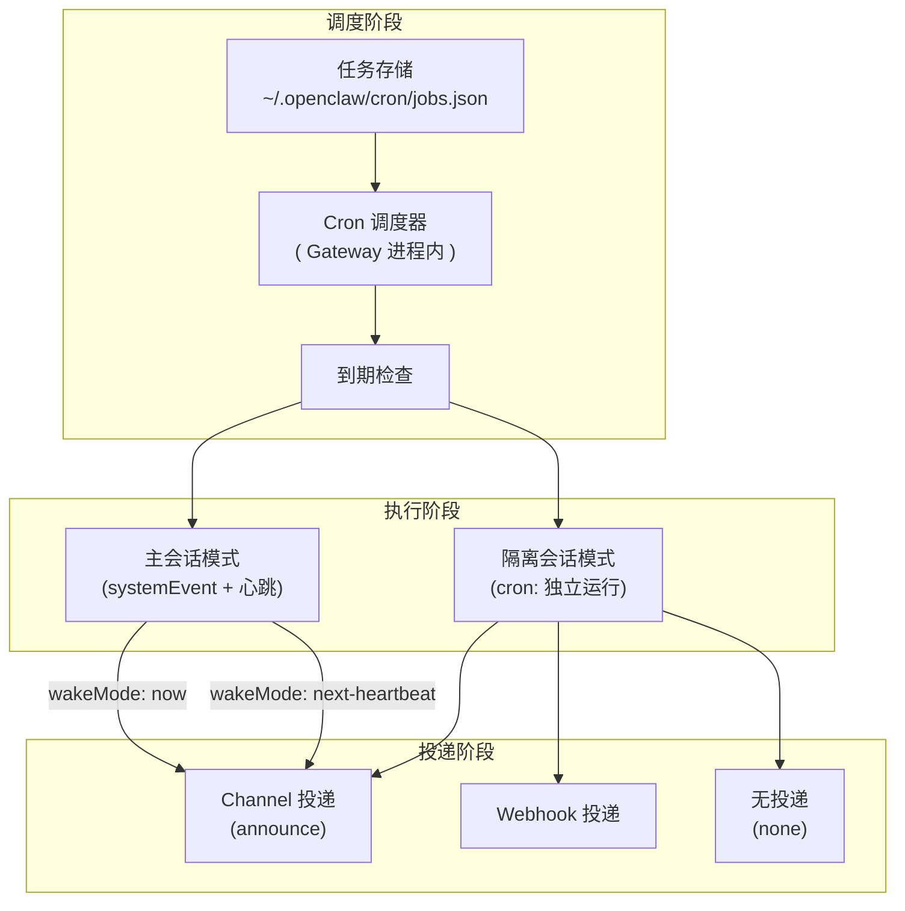
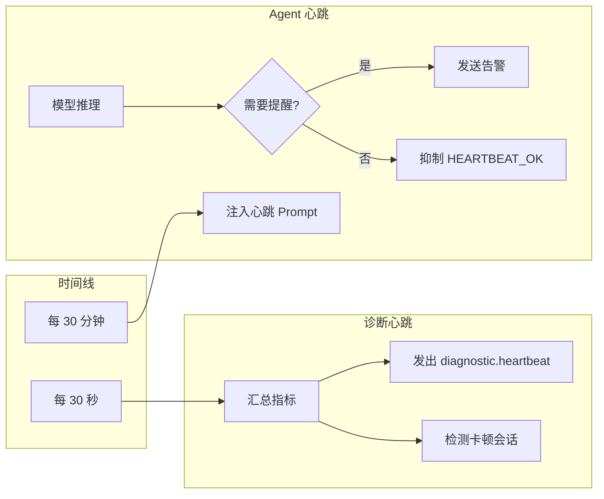
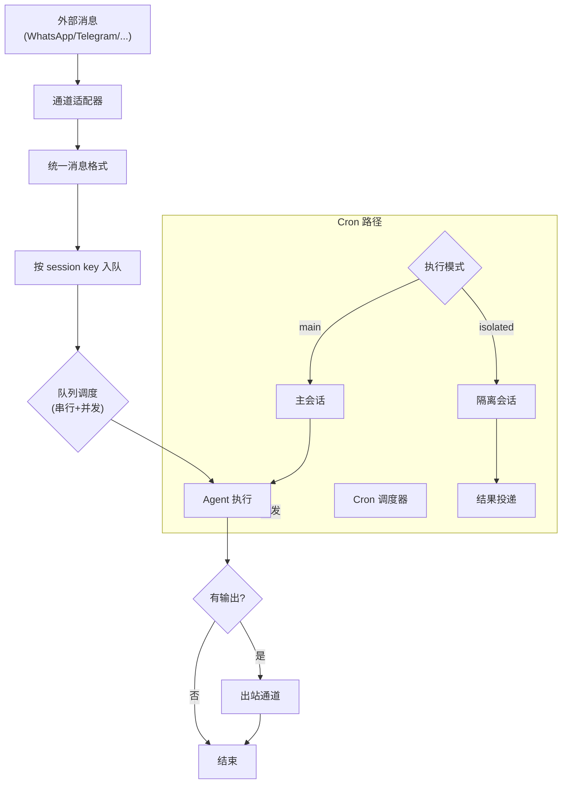

# OpenClaw 系统架构

## 概述

OpenClaw 是一个自托管的 AI 助手网关，旨在将 WhatsApp、Telegram、Discord、iMessage 等多种消息通道统一接入到 AI 编程 Agent。整个系统采用**单进程 Gateway 架构**，所有通道连接、消息路由、Agent 执行与调度都在同一个进程中完成。这种设计简化了部署和运维，同时通过层次化的模块划分实现了良好的可扩展性。

OpenClaw 的系统架构可以划分为四个层次，从上到下依次为：

- **接入与调度层**：负责外部消息的统一接入、协议解析、消息队列与会话调度
- **核心能力层**：提供 Agent 运行所需的基础能力，包括内置工具、记忆管理与技能系统
- **生态扩展层**：通过插件和 MCP 协议扩展系统能力，心跳机制在本层承担健康监控职责
- **自主进化层**：包含心跳监控、定时任务（Cron）与自我维护机制，使系统能够自驱动地执行周期任务和自愈

上图展示了四层之间的数据流向和控制关系。接下来我们将逐层展开说明每个层次的职责和核心设计逻辑。

---

## 第一层：接入与调度层

### Gateway 网关架构

Gateway 是整个系统的核心枢纽，运行在单个进程中，负责所有消息通道的接入和管理。它同时提供 WebSocket 和 HTTP 两个接口：

- **WebSocket 接口**：用于控制面客户端（macOS 应用、CLI、Web 控制台）以及节点设备（iOS/Android/headless）的长连接。所有客户端通过 WebSocket 与 Gateway 通信，握手时声明自己的角色（operator 或 node）和能力。
- **HTTP 接口**：提供 OpenAI 兼容的 API、工具调用接口以及内部 HTTP 路由。

#### 设计要点

- **单进程单端口**：Gateway 绑定一个端口（默认 18789），所有通道连接和客户端请求都通过这个端口进入。这种设计简化了防火墙配置和连接管理。
- **协议握手**：客户端连接时必须发送 `connect` 请求，包含协议版本、客户端信息、角色、权限范围等。Gateway 验证通过后返回 `hello-ok`，连接正式建立。
- **请求-响应-事件模型**：Gateway 使用统一的帧格式 `{type: "req"|"res"|"event", ...}`。客户端发送请求（req），Gateway 返回响应（res）；Gateway 也可以主动推送事件（event）给客户端，如 `tick`、`presence`、`agent`、`heartbeat` 等。
- **配对与本地信任**：设备配对基于设备指纹，新设备需要获得批准地连接（才能连接。本loopback 或 Tailscale 地址）可以自动批准，保证同主机体验流畅。
- **协议类型化**：Gateway 使用 TypeBox 定义协议类型，生成 JSON Schema 用于帧验证，并进一步生成 Swift 模型供客户端使用。

### 消息队列与调度

外部消息到达 Gateway 后，经历从通道适配到 Agent 执行的完整流程。为了避免多个消息同时处理导致资源竞争和数据不一致，OpenClaw 实现了**会话车道的消息队列调度机制**。

#### 设计逻辑

- **入站消息统一化**：无论消息来自哪个通道（WhatsApp、Telegram、Discord 等），都会被转换为统一的内部消息格式，包含发送者、内容、时间戳、元数据等信息。
- **会话车道（Session Lane）**：每条消息根据目标会话的 key（如 `agent:main`）进入对应的会话车道。同一会话的车道是串行化的，保证同一个会话的消息不会被并发处理。
- **全局车道（Global Lane）**：会话车道进一步进入全局车道进行并发控制。全局车道有一个并发上限（默认主会话 4 路，子会话 8 路），防止过多并发的 Agent 运行耗尽资源。
- **队列模式**：消息进入车道时可以指定处理模式：
  - `collect`：将多条消息合并为一次响应（默认）
  - `steer`：立即注入当前运行，取消后续工具调用
  - `followup`：排队等待下一次 Agent 运行
  - `steer-backlog`：立即注入当前运行，同时保留消息用于后续响应
- **溢出策略**：当队列满时，可以选择丢弃最旧的（old）、丢弃最新的（new）或生成一条摘要消息（summarize）替代。

#### 消息流图示

这条消息流保证了：即使多个通道同时有消息进入，同一会话的消息也会被串行处理，而不同会话之间可以安全地并发运行。

> 消息队列的完整设计和技术细节可以参考 [消息队列](/concepts/queue)。

---

## 第二层：核心能力层

核心能力层为 Agent 的运行提供基础能力支撑，包括执行工具、记忆存储和技能加载三个子系统。

### 内置工具集

OpenClaw 内置了一组核心工具，供 Agent 在运行过程中调用：

- **文件系统工具**：`Read`、`Write`、`Edit`、`Glob`、`Grep` 等，用于操作工作区文件
- **执行工具**：`Exec` 用于在主机上执行命令，受 `tools.exec.policy` 控制
- **Agent 控制工具**：`Agent` 用于启动子 Agent 运行，`Sag` 用于调用技能

内置工具的特点是**始终可用**，不受插件或外部依赖影响。它们的行为受到策略配置（policy）的约束，例如某些危险操作可能需要手动确认。

### 记忆管理

OpenClaw 采用**工作区 Markdown 文件**作为记忆的事实来源，而非存储在数据库中。这种设计的核心理念是：文件即记忆，模型只记住写入文件的内容。

#### 记忆文件结构

- `memory/YYYY-MM-DD.md`：每日日志，按日期追加，是日常工作的记录
- `MEMORY.md`：长期记忆，只有在主会话、私人上下文中加载，用于存放持久化的偏好和重要信息

#### 记忆工具

Agent 可以通过两个工具访问记忆：

- `memory_search`：语义搜索过去的记忆片段
- `memory_get`：读取指定的记忆文件或文件中的特定段落

#### 记忆刷写（Memory Flush）

当会话接近自动压缩（compaction）阈值时，OpenClaw 会触发一次静默的 Agent 轮次，提醒模型在压缩前将重要信息写入记忆文件。这个机制称为**记忆刷写**，确保关键信息不会因上下文压缩而丢失。

> 记忆系统的完整设计可以参考 [记忆](/concepts/memory) 和 [Agent 工作区](/concepts/agent-workspace)。

### 技能系统

技能（Skills）是影响 Agent 行为和可用能力的配置文件。它们从三个位置加载，按优先级依次为：工作区、内置、插件。

#### 技能来源

- **工作区技能**：`AGENTS.md`、`SOUL.md`、`TOOLS.md`、`IDENTITY.md`、`USER.md` 等文件，在会话启动时注入到系统提示中
- **内置技能**：随 OpenClaw 安装包一起分发，提供标准行为
- **插件技能**：由插件提供的技能，通过插件注册机制加载

#### 技能的作用

技能定义了 Agent 的「行事风格」和「可用工具提示」。例如 `AGENTS.md` 包含操作指令，`TOOLS.md` 包含工具使用约定，`SOUL.md` 定义人格和语气。

> 技能系统的详细用法可以参考 [技能](/tools/skills)。

#### 核心能力层的协作

请求进入后，技能系统先加载行为定义，然后 Agent 运行时根据这些定义和会话上下文执行任务，过程中调用工具并可能写入记忆。

---

## 第三层：生态扩展层

生态扩展层通过插件和 MCP 协议为系统提供可拔插的扩展能力。这一层的设计遵循「核心稳定、扩展灵活」的原则：核心路径不依赖任何扩展，但扩展可以无缝挂载到系统中。

### MCP 工具协议

MCP（Model Context Protocol）是一个标准化的工具暴露协议，允许外部服务将自己的能力以工具形式暴露给 Agent 使用。OpenClaw 支持通过 MCP 桥接外部工具，扩展 Agent 的能力边界。

在架构中，MCP 工具与内置工具地位相当，都通过统一的方式被 Agent 调用。不同之处在于 MCP 工具由外部进程提供，需要通过进程间通信调用。

### 插件系统

插件是 OpenClaw 扩展能力的核心方式。插件是一个 TypeScript 模块，运行在 Gateway 进程内部，与核心代码共享同一进程空间。

#### 插件可以注册的内容

- **Gateway RPC 方法**：扩展 Gateway 的能力，如自定义的状态查询或控制命令
- **HTTP 路由**：插件可以暴露自己的 HTTP 端点，用于接收外部请求
- **Agent 工具**：插件可以向 Agent 提供额外的工具，如语音通话、发送邮件等
- **CLI 命令**：为 `openclaw` 命令行添加新的子命令
- **后台服务**：插件可以在 Gateway 启动时启动自己的后台任务
- **技能**：插件可以提供额外的技能定义
- **自动回复命令**：无需调用 Agent 即可响应特定命令

#### 插件的安全性

插件与核心运行在同一进程中，因此插件代码被认为是受信任的。配置验证通过 manifest 和 JSON Schema 完成，不会执行插件代码。这意味着插件拥有与核心同等的系统访问权限。

> 插件系统的完整文档可以参考 [插件](/tools/plugin)。

### 心跳在扩展层的角色

**心跳机制在生态扩展层承担健康监控的职责**。具体来说，心跳会周期性地检测插件和 MCP 工具的可达性和健康状态。如果某个扩展组件出现异常，心跳可以：

- 记录错误日志供运维人员排查
- 触发告警通知用户
- 在某些情况下影响消息调度（例如暂时绕过不可用的扩展）

重要的是，这种监控是**非侵入式**的：即使所有扩展都不可用，核心的消息处理路径仍然可以正常工作，只是某些高级功能不可用而已。

---

## 第四层：自主进化层

自主进化层是整个系统的「自驱动引擎」。它包含三个核心机制：Agent 心跳、诊断心跳和定时任务（Cron）。这些机制使系统能够在没有外部触发的情况下主动执行任务、监控系统健康并做出响应。

### Agent 心跳

Agent 心跳是 OpenClaw 最具特色的机制之一。它让 Agent 能够**主动感知和检查**，而不仅仅是被动响应用户消息。

#### 设计逻辑

- **周期性触发**：Agent 心跳按配置的间隔（默认 30 分钟，可在 0 分钟到数小时之间调整）触发一次
- **主会话执行**：心跳运行在 Agent 的主会话中，共享完整的对话上下文
- **心跳 Prompt**：每次心跳触发时，系统会向模型注入一个预设的提示词，通常包含类似「检查 HEARTBEAT.md 并汇报」的指令
- **HEARTBEAT_OK 响应**：如果模型判断没有需要提醒用户的事项，它应该回复 `HEARTBEAT_OK`。这个响应会被抑制，不会发送给用户，从而避免无意义的通知打扰
- **告警下发**：如果模型判断有需要提醒的事项，它返回实际的提醒内容，系统会将这条消息发送到配置的 `target`（如最后一个对话渠道）

#### 配置选项

Agent 心跳支持丰富的配置选项：

| 配置项 | 说明 | 默认值 |
|--------|------|--------|
| `every` | 心跳间隔 | `30m`（有 OAuth 时 `1h`） |
| `target` | 告警发送目标 | `none`（不发送） |
| `to` | 具体的接收者 | 无 |
| `activeHours` | 活跃时间段 | 无限制 |
| `includeReasoning` | 是否发送思考过程 | `false` |
| `lightContext` | 是否仅加载 HEARTBEAT.md | `false` |

#### 典型用途

- **周期性检查**：检查邮件、日历、待办事项，发现需要关注的事项时主动提醒
- **轻量级监控**：在用户忙碌时做一个简单的「有什么需要我帮忙的」检查
- **长时间未互动后的关怀**：如果用户超过 8 小时没有互动，发送一条温和的问候

#### Agent 心跳流程图

> Agent 心跳的完整配置和使用方法可以参考 [心跳](/gateway/heartbeat)。

### 诊断心跳

诊断心跳与 Agent 心跳不同，它**不涉及 AI 模型调用**，而是 Gateway 内部的指标汇总机制。

#### 设计逻辑

- **固定间隔**：诊断心跳每 30 秒触发一次（在 Gateway 进程内通过 `setInterval` 实现）
- **指标收集**：每次触发时，诊断心跳会汇总以下指标：
  - Webhook 接收/处理/错误计数
  - 当前活跃的 Agent 运行数量
  - 等待处理的队列深度
  - 各会话的最后活跃时间
- **事件发出**：汇总后发出 `diagnostic.heartbeat` 事件，供监控系统和调试工具消费
- **卡顿检测**：如果某个会话处于 processing 状态超过一定时间（可配置），会记录警告日志

#### 用途

- **监控面板**：运维人员可以通过订阅 `diagnostic.heartbeat` 事件构建实时监控面板
- **异常告警**：当错误计数异常升高或队列积压时触发告警
- **调试**：查看系统运行状态，排查性能问题

### Cron 定时任务

Cron 是 Gateway 内置的精确调度器，用于在指定时间执行任务。与 Agent 心跳的「周期性感知」不同，Cron 适用于「需要在精确时间执行」的场景。

#### 任务类型

Cron 支持三种调度方式：

- **`at`**：一次性任务，在指定的时间点执行一次
- **`every`**：固定间隔任务，每隔一定时间执行一次
- **`cron`**：标准 Cron 表达式（5 字段或 6 字段含秒），支持时区配置

#### 执行模式

Cron 任务有两种执行模式：

- **主会话模式**（`sessionTarget: "main"`）：在主会话中执行，通过系统事件（`systemEvent`）注入任务内容，并可以选择立即唤醒心跳或等待下次心跳处理
- **隔离会话模式**（`sessionTarget: "isolated"`）：创建一个全新的会话（`cron:<jobId>`）来执行任务，不影响主会话的上下文

#### 投递方式

任务执行完成后，结果可以通过以下方式投递：

- **Channel 投递**（`announce`）：将结果发送到指定的聊天渠道
- **Webhook 投递**（`webhook`）：将结果 POST 到指定的 HTTP URL
- **无投递**（`none`）：仅在内部执行，不发送任何通知

#### 重试与退避

- **临时错误**：遇到速率限制、提供商过载、网络问题时会自动重试，使用指数退避策略（30 秒 → 1 分钟 → 5 分钟）
- **永久错误**：认证失败、配置错误等永久性问题会立即禁用任务
- **历史记录**：每次执行都会记录到 `~/.openclaw/cron/runs/<jobId>.jsonl`，并有自动裁剪机制防止日志过大

#### Cron 与心跳的协作

Cron 任务可以配置 `wakeMode` 来决定何时处理结果：

- **`now`**：任务完成后立即触发一次 Agent 心跳来处理结果
- **`next-heartbeat`**：等待下次常规心跳时一起处理

这种设计让 Cron 任务可以「借用」心跳的上下文来处理结果，实现了两个机制的协同工作。

#### Cron 流程图

> Cron 定时任务的完整文档可以参考 [定时任务](/automation/cron-jobs)。

### 自我进化逻辑

除了上述三个主要机制外，OpenClaw 还包含一系列「自我维护」能力，使系统能够根据运行状态自我调整：

- **异常检测**：基于诊断心跳的指标，当发现异常模式（如持续错误、卡顿会话）时记录警告或触发告警
- **自动重试**：Cron 任务失败后自动应用指数退避策略重试
- **记忆刷写**：会话压缩前自动触发记忆刷写，确保重要信息不丢失
- **配置热重载**：支持在不重启 Gateway 的情况下加载新配置（部分配置需要重启）
- **会话压缩**：当上下文 token 接近模型限制时，自动压缩历史消息，保留关键信息

这些机制共同构成了系统的「自主进化」能力，使其能够在无人干预的情况下长时间稳定运行。

---

## 核心机制图示汇总

### 心跳机制全景

### 消息流全景

---

## 相关文档

- [Gateway 架构](/gateway/index) - 网关的运行模型和操作指南
- [Gateway 协议](/gateway/protocol) - WebSocket 协议细节
- [消息队列](/concepts/queue) - 队列设计细节
- [心跳](/gateway/heartbeat) - Agent 心跳配置参考
- [定时任务](/automation/cron-jobs) - Cron 任务完整文档
- [心跳与定时任务对比](/automation/cron-vs-heartbeat) - 如何选择合适的调度方式
- [记忆系统](/concepts/memory) - 记忆管理设计
- [Agent 工作区](/concepts/agent-workspace) - 工作区文件结构
- [技能系统](/tools/skills) - 技能加载和使用
- [插件系统](/tools/plugin) - 插件开发指南
